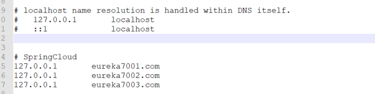
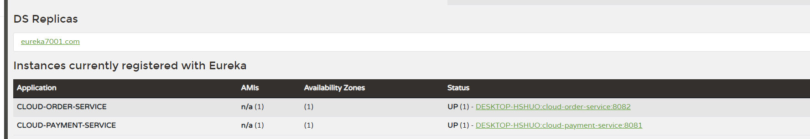

# SpringCloud
- 参考尚硅谷 SpringCloud 学习源码
- 依赖版本都是最新版

<br>
<br>

# 初步搭建微服务架构
- 多 Maven 架构
- 引入SpringCloud、SpringBoot、SpringCloudAlibaba
- [参考 相关版本配置问题](https://blog.nowcoder.net/n/1b1b98049786426da25d5169ea2f4d85)

<br>
<br>

# 背景知识
#### 什么是服务治理
- 在传统的 RPC 远程调用框架中，管理每个服务与服务之间依赖关系比较复杂、管理比较复杂，所以需要使用服务治理，管理服务与服务之间的依赖关系，可以实现服务调用、负载均衡、容错等，实现服务注册与发现

<br>

#### CAP 理论
- CAP：Consistency（强一致性）、Availability（可用性）、Partition tolerance（分区容错性）
- 一个分布式系统不可能同时很好的满足一致性、可用性和分区容错性这三个需求，最多只能同时较好的满足两个。CA一般是单点集群，在可拓展上不太强；CP一般性能不是特别高；AP一般对一致性要求低一些
- CAP 理论关注粒度是数据，而不是整体系统设计的策略
  

<br>
<br>

# SpringCloud 服务注册与发现
# Eureka
#### 概念
- SpringCloud 封装了 Netfix 公司开发的 Eureka 模块来实现服务治理
- Eureka 采用了 CS 的设计架构，Eureka Server 作为服务注册功能的服务器，是服务注册中心。而系统中的其他微服务，使用 Eureka 的客户端连接到 Eureka Server 并维持心跳连接、这样系统的维护人员就可以通过 Eureka Server 来监控系统中各个微服务是否正常运行
- 在服务注册与发现中，有一个注册中心。当服务器启动的时候，会把当前自己服务器的信息 比如 服务地址通讯地址等以别名方式注册到注册中心上。另一方（消费者|服务提供者）以该别名的方式去注册中心上获取到实际的服务通讯地址，然后再实现本地 RPC 调用
- RPC 远程调用框架的思想：在于注册中心，因为使用注册中心管理每个服务与服务之间的一个依赖关系（服务治理概念）。在任何 RPC 远程框架中，都会有一个注册中心（存放服务地址相关信息（接口地址））
- [类似于 Dubbo 系统架构图](https://blog.nowcoder.net/hshuo/213162?page=1)  
  

<br>

#### 组件
- Eureka Server 提供服务注册服务：各个微服务节点通过配置启动后，会在 Eureka Server 中进行注册，这样 Eureka Server 中的服务注册表中将会存储所有可用服务节点的信息，服务节点的信息可以在界面中直观看到
- Eureka Client 通过注册中心进行访问：是一个 Java 客户端，用于简化 Eureka Server 的交互，客户端同时也具备一个内置的、使用轮询（round-robin）负载算法的负载均衡器。在应用启动后，将会向 Eureka Server 发送心跳（默认周期为 30 秒）。如果 Eureka Server 在多个心跳周期内没有接收到某个节点的心跳，Eureka Server将会从服务注册表中把这个服务节点移除（默认 90 秒）

<br>

#### 单机 Eureka 配置
- 主要通过 pom.xml 引入 spring-cloud-starter-netflix-eureka-client、 spring-cloud-starter-netflix-eureka-server。之后再 yml 添加相应配置，主启动类添加 @EnableEurekaClient、 @EnableEurekaServer
1. 引入 pom 依赖，分为 Eureka 的服务注册中心，和 Eureka 的客户端
``` java
        <!--引入 Eureka 组件作为服务注册中心  -->
        <dependency>
            <groupId>org.springframework.cloud</groupId>
            <artifactId>spring-cloud-starter-netflix-eureka-server</artifactId>
        </dependency>
        
        <!--引入 Eureka Client  -->
        <dependency>
            <groupId>org.springframework.cloud</groupId>
            <artifactId>spring-cloud-starter-netflix-eureka-client</artifactId>
        </dependency>
```
2. 写 application.yml  文件，添加 Eureka 的相关配置

``` java
# Eureka Server 添加的配置
eureka:
  instance:
    # eureka服务端的实例名称
    hostname: localhost
  client:
    # false表示不向注册中心注册自己。
    register-with-eureka: false
    # false表示自己端就是注册中心，我的职责就是维护服务实例，并不需要去检索服务
    fetch-registry: false
    service-url:
      # 设置与Eureka Server交互的地址查询服务和注册服务都需要依赖这个地址。
      defaultZone: http://${eureka.instance.hostname}:${server.port}/eureka/


# Eureka Client 添加的配置
eureka:
  client:
    # 表示是否将自己注册进EurekaServer默认为true。
    register-with-eureka: true
    # 是否从EurekaServer抓取已有的注册信息，默认为true。单节点无所谓，集群必须设置为true才能配合 ribbon 使用负载均衡
    fetchRegistry: true
    service-url:
      defaultZone: http://localhost:7001/eureka

```
3. 写启动类 EurekaMain.class, 添加 @EnableEurekaClient、 @EnableEurekaServer

``` java
# 客户端添加
@SpringBootApplication
@EnableEurekaClient
public class OrderMain {
    public static void main(String[] args) {
        SpringApplication.run(OrderMain.class, args);
    }
}


# Eureka 服务端添加
@SpringBootApplication
@EnableEurekaServer
public class EurekaMain {
    public static void main(String[] args) {
        SpringApplication.run(EurekaMain.class, args);
    }
}
```

4. 启动服务测试连接


<br>

#### 集群 Eureka 配置
- 在原有的基础上，新添加一个 Eureka Server
- 相互注册将 Eureka 配置的 defaultZone 添加另外的 Eureka 的 service-url。使用 Eureka 集群也只需要将配置的 defaultZone 添加注册的 Eureka service-url

1. Eureka Server 配置 彼此之间相互注册
```yml
eureka:
  instance:
    # eureka 服务端的实例名称
    hostname: eureka7002.com
  client:
    # false 表示不向注册中心注册自己。
    register-with-eureka: false
    # false 表示自己端就是注册中心，我的职责就是维护服务实例，并不需要去检索服务
    fetch-registry: false
    service-url:
     defaultZone: http://eureka7001.com:7001/eureka/


eureka:
  instance:
    # eureka服务端的实例名称
    hostname: eureka7001.com
  client:
    # false表示不向注册中心注册自己。
    register-with-eureka: false
    # false表示自己端就是注册中心，我的职责就是维护服务实例，并不需要去检索服务
    fetch-registry: false
    service-url:
      # 设置与Eureka Server交互的地址查询服务和注册服务都需要依赖这个地址。
      #      defaultZone: http://${eureka.instance.hostname}:${server.port}/eureka/
      defaultZone: http://eureka7002.com:7002/eureka/
```
2. Eureka Client 使用只需要增加 defaultZone 里面的 server-url 即可
```yml
      # 集群版
      defaultZone: http://eureka7001.com:7001/eureka,http://eureka7002.com:7002/eureka
```
3. 配置 host 文件 C:\Windows\System32\drivers\etc 配置后重启生效

4. 测试集群是否成功、访问 http://eureka7002.com:7002/、http://eureka7001.com:7001/


<br>

#### Eureka 自我保护
- 默认情况下，如果 Eureka Server 在一定时间内没有收到某个微服务实例的心跳，Eureka Server 将会注销该实例（默认 90 秒）。但是当发生网络分区故障（延时、卡顿、拥挤）时，微服务与 Eureka Sever 之间无法正常通信，由于服务本身是健康的，所以此时不应该注销这个微服务。Eureka 通过 自我保护模式 解决这个问题，当 Eureka Server 节点 在短时间内丢失过多客户端时（可能发生了网络分区故障），那么该节点会进入自我保护模式
- 某时刻某一个微服务不可用了， Eureka 不会立刻清理，依旧会对该微服务的信息进行保存
- 属于 CAP 理论的 AP 设计思想，保证高可用、分区容错性
- 标志字样：
  

<br>

**取消自我保护机制**

``` yml
# Eureka Client 配置
eureka:
  instance:
    # Eureka 客户端向服务端发送心跳的时间间隔，单位为秒（默认30秒）
    lease-renewal-interval-in-seconds: 1
    # Eureka 服务端收到最后一次心跳后等待时间上限，单位为秒（默认90秒），超时将剔除服务
    # 如果 Eureka 服务端同时有此项配置，服务端优先级大于客户端
    lease-expiration-duration-in-seconds: 2
    
    
# Eureka Sever 配置   
eureka:
  server:
    # 关闭自我保护机制，保证不可用服务及时被剔除
    enable-self-preservation: false
    eviction-interval-timer-in-ms: 2000
```

<br>
<br>

# Zookeeper
- 服务注册的节点是临时节点，属于 CAP 理论的 CP 设计思想，保证数据一致性、分区容错性
- 引入配置与 Eureka 大体一致，都是使用 @EnableDiscoveryClient、@LoadBalanced 注解

<br>

#### 安装
- [Docker 中启动 ZooKeeper](https://cloud.tencent.com/developer/article/1707754)

名称 | 命令
:---: | :---:
使用 Docker 安装 | docker run --name zookeeper -p 2181:2181 --restart always -d  zookeeper
进入容器 | docker exec -it b3cd072581b2 bash
进入 zookeeper 客户端 | ./bin/zkCli.sh -server 127.0.0.1:2181
验证是否注册上节点 | 

<br>
<br>

# Consul
#### 概念
- Consul 是一套开源的分布式服务发现和配置管理系统，由 HashiCorp 公司用 Go 语言开发
- 提供了微服务系统中的服务治理、配置中心、控制总线等功能。这些功能中的每一个都可以根据需要单独使用，也可以一起使用以构建全方位的服务网格，总之 Consul 提供了一种完整的服务网格解决方案
- 具有很多有点。包括：基于 raft 协议，比较简洁；支持健康检查，同时支持 HTTP 和 DNS 协议；支持跨数据中心的 WAN 集群；提供图形界面；跨平台，支持 Linux、Mac、Windows; Key-Value 的存储方式
- [Consul 官网地址](https://developer.hashicorp.com/consul/docs/intro)
- [Spring Cloud Consul](https://www.springcloud.cc/spring-cloud-consul.html)

<br>

#### 安装
- [Docker 中启动 Consul](https://blog.csdn.net/weixin_44690195/article/details/124337028)

名称 | 命令
:---: | :---:
使用 Docker 安装 | docker run --name consul1 -d -p 8500:8500 -p 8300:8300 -p 8301:8301 -p 8302:8302 -p 8600:8600 consul agent -server -bootstrap-expect=1 -ui -bind=0.0.0.0 -client=0.0.0.0
访问客户端 | http://47.95.211.172:8500/

<br>

#### 缺点
- Consul 所在的 HashiCorp 公司宣布，不允许中国境内使用该公司旗下 Terraform、Consul、Vagrant 企业版


<br>
<br>

# Nacos
- 目前章节主要包含 SpringCloud 内容，后续会补充 SpringCloudAlibaba

<br>
<br>

# 总结
- 一般会选择 AP + 最终一致性的方案来完成
- 简单来讲：AP在系统数据不同步的时候访问会返回旧值、CP在系统数据不同步的时候访问会返回错误状态（因为要保证系统之间的一致性）


<br>
<br>

# SpringCloud 服务负载与调用
# 背景知识
#### 负载均衡的概念
- 可以参考 [Dubbo 的负载均衡](https://blog.nowcoder.net/n/078d7469b60f4fc78066519d506a027c)
- 简单来说就是将用户的请求平摊的分配到多个服务上，从而达到系统的高可用。常见的负载均衡有软件 Nginx、LVS、硬件 F5 等

<br>

#### 负载均衡的分类
- 进程内的负载均衡：将负载均衡逻辑集成到消费方，消费方从服务注册中心获知有哪些地址可用，然后自己再从这些地址中选择出一个合适的服务器。它属于一个类库，集成于消费方进程，消费方通过它来获取服务提供方的地址。例如：Ribbon
- 集中式的负载均衡：在服务的消费方和提供方之间使用独立的负载均衡设施，由该设施负责把访问请求通过某种策略转发至服务的提供方。例如：F5、Nginx

<br>
<br>

# Ribbon
#### 概念
- SpringCloud Ribbon 是基于 Netflix Ribbon 实现的一套客户端负载均衡的工具
- Ribbon 是 Netflix 发布的开源项目，主要功能是提供客户端的软件负载均衡算法和服务调用。Ribbon 客户端组件提供一系列完善的配置项如连接超时，重试等。简单来说，就是在配置文件中列出 LoadBalancer 后面所有的机器，Ribbon 会自动的帮助你基于某种规则（简单轮询、随机连接等）去连接这些机器。同时我们也很容易使用 Ribbon 实现自定义的负载均衡算法

<br>

#### 使用
- Ribbon 是一个软负载均衡客户端组件，可以和其他客户端结合使用，例如：Eureka。
- 但是 spring-cloud-starter-netflix-eureka-client 3.0版本以上已经将 Ribbon 替换成了 LoadBalancer，所以需要我们手动添加依赖 spring-cloud-starter-netflix-ribbon
- [Maven 仓库地址](https://mvnrepository.com/artifact/org.springframework.cloud/spring-cloud-starter-netflix-ribbon)   
  

<br>

#### 实质
- **负载均衡 + RestTemplate**
- RestTemplate 有很多方法：getForObject()、getForEntity()、postForObject()、postForEntity()
- Object 返回的是 JSON，Entity 返回的是 ResponseEntity 对象（响应头、状态码、响应体）等信息
- [RestTemplate 官网](https://docs.spring.io/spring-framework/docs/5.2.2.RELEASE/javadoc-api/org/springframework/web/client/RestTemplate.html)

<br>

#### 负载均衡算法
- RoundRobinRule：轮询
- RandomRule：随机
- RestryRule：先按照 RoundRobinRule 策略获取服务，如果获取服务失败则在指定时间内会进行重试，获取可用的服务
- WeightedResponseTimeRule：对 RoundRobinRule 的拓展，响应速度越快的实例选择权重越大，越容易被选择
- BestAvailableRule：会先过滤由于多次访问故障而处于断路器跳闸状态的服务，然后选择一个并发量最小的服务
- AvailabilityFilteringRule：会先过滤故障实例，再选择并发较小的实例
- ZoneAvoidanceRule：默认规则，复合判断 server 所在区域的性能和 server 的可用性选择服务器

<br>

**更改默认的算法**
- 注意不能放在 @ComponentScan 所扫描的当前包下以及子包下，否则我们自定义的这个配置类就会被所有的Ribbon客户端所共享，达不到特殊化定制的目的了。   
  
- 手写一个@Configuration配置类，返回对应的算法
  
- 在对应的 @Controller 层或者主启动类上面添加 @RibbonClient 注解
  


<br>

**自定义算法**
- 在配置类里面写对应的规则
  
- 通过 @DiscoveryClient 获取对应服务名的所有服务
  


<br>

#### Ribbon 与 Nginx 的区别
- Ribbon 是本地负载均衡客户端，在调用微服务接口时候，会在注册中心上获取注册信息服务列表之后缓存到 JVM 本地，从而在本地实现 RPC 远程服务调用技术
- Nginx 是服务器负载均衡，客户端所有请求都会交给 Nginx，然后由 Nginx 实现转发请求。也就是负载均衡是由服务端实现的

<br>

#### 缺点
- [ribbon 官网地址](https://github.com/Netflix/ribbon)
- 目前处于维护状态，后期致力于将 LoadBalancer 平替 Ribbon
  

<br>

#### 遇到问题
- 使用 SpringCloud3.0 以上版本还仍然想用 ribbon 的时候，会出现我的服务已经成功注册到eureka server 中了，而 ribbon 服务器找不到已经注册的服务。猜测的因为 ribbon 服务器没有在eureka server中注册成功，所以不能识别主机名称。
- 翻阅解决的主要方式就是降低版本配置
- [eureka中显示有服务但是通过ribbon调用显示No instances available for service-hello的问题](https://blog.51cto.com/u_15707676/5857021)
- [Ribbon and Eureka - No instances available](https://stackoverflow.com/questions/46747246/ribbon-and-eureka-no-instances-available)

<br>
<br>


# OpenFeign
#### Feign 概念
- Feign 是一个声明式 WebService 客户端。使用 Feign 能让编写 WebService 客户端更加简单，更容易
- Feign 内置了 Ribbon，用来做客户端的负载均衡，去调用服务注册中心的服务。不同的是，Feign 进一步封装，只需要通过定义服务绑定接口且以声明式的方法，从而完成服务调用。有点类似于 Dubbo
- 前面在使用 Ribbon + RestTemplate 时，利用 RestTemplate 对 http 请求的封装处理，形成了一套模板化的调用方法。但是在实际开发中，由于对服务依赖的调用可能不止一处，往往一个接口会被多处调用，所以通常都会针对每个微服务自行封装一些客户端类来包装这些依赖服务的调用。所以，Feign 在此基础上做了进一步封装，有他来帮助我们定义和实现依赖服务接口。在 Feign 的实现下，我们只需要创建一个接口并使用注释的方式来配置它，即可完成对服务提供者的接口绑定，简化了使用 Ribbon 时，自动封装服务调用客户端的开发量

<br>

#### OpenFeign 概念
- 在 Feign 的基础上支持 SpringMVC 注解 @RequestMapping 等等。可以通过 @FeignClient 解析 @RequestMapping 注解下的接口，并通过动态代理的方式产生实现类，实现类中做负载均衡并调用其他服务。
- 新版本的 OpenFeign 已经不在内置 Ribbon

<br>

#### 使用
- Feign 提供了日志打印功能，我们可以通过配置来调整日志级别，从而了解 Feign 中 Http 请求的细节。也就是对 Feign 接口的调用情况进行监控和输出
- Feign 也可以对超时进行配置  
  


<br>
<br>


# SpringCloud 服务降级、熔断
# 基础知识
#### 服务雪崩
- 多个微服务之间调用的时候，假设微服务 A 调用微服务 B 和微服务 C，微服务 B 和微服务 C 又调用其它的微服务，这就是所谓的“扇出”。如果扇出的链路上某个微服务的调用响应时间过长或者不可用，对微服务 A 的调用就会占用越来越多的系统资源，进而引起系统崩溃，也就是所谓的“雪崩效应”

<br>
<br>

# Hystrix
#### 概念
- [Hystrix 官网](https://github.com/Netflix/Hystrix)
- Hystrix 是一个用于处理分布式系统的延迟和容错的开源库，在分布式系统中，许多依赖不可避免的会调用失败，比如超时、异常等。Hystrix 能够保证在一个依赖出问题的情况下，不会导致整体服务失败，避免级联故障，以提高分布式系统的弹性
- “断路器”本身是一种开关装置，当某个服务单元发生故障之后，通过断路器的故障监控，向调用反返回一个符合预期的、可处理的备选响应（FallBack），而不是长时间的等待或者抛出调用方无法处理的异常，这样就保证了服务调用方的线程不会被长时间、不必要地占用，从而避免了在分布式系统中的蔓延、乃至雪崩

<br>

#### 工作流程
1. 创建 HystrixCommand（用在依赖的服务返回单个操作结果的时候）或者 HystrixObserableCommand（用在依赖的服务返回多个操作结果的时候）对象
2. 命令执行。其中 HystrixCommand 实现了下面前两种执行方式；而 HystrixObserableCommand 实现了后两种执行方式
  - execute：同步执行，从依赖的服务返回一个单一的结果对象，或者发生错误的时候抛出异常
  - queue：异步执行，直接返回一个 Future 对象，其中包含了服务执行结束时要返回的单一对象
  - observe：返回 Obserable 对象，代表了操作的多个结果，是一个 Hot Obserable（不论“事件源”是否有“订阅者”，都会在创建后对事件进行发布，所以对于 Hot Obserable 的每一个“订阅者”都有可能是从“事件源”的中途开始的，并可能只是看到了整个操作的局部过程）
  - toObserable：同样会返回 Obserable 对象，也代表了操作的多个结果，但它返回的是一个 Cold Obserable（没有“订阅者”的时候并不会发布事件，而是进行等待，直到有“订阅者”之后才发布事件），所以对于 Cold Obserable 的订阅者，可以保证从一开始看到整个操作的全部过程
3. 若当前命令的请求缓存功能是被启动的，并且该命令缓存命中，那么缓存的结果会立刻以 Obserable 对象的形式返回
4. 检查断路器是否为打开状态。如果断路器是打开的，那么 Hystrix 不会执行命令，而是转接到 fallback 处理逻辑；如果断路器是关闭的，检查是否有可用资源来执行命令
5. 线程池/请求队列/信号量是否沾满。如果命令依赖服务的专有线程池和请求队列或者信号量（不使用线程池的时候）已经被占满，那么 Hystrix 也不会执行命令，而是转接到 fallback 处理逻辑
6. Hystrix 会根据我们编写的方法来决定采取什么样的方式去请求依赖服务
  - HystrixCommand.run()：返回一个单一的结果
  - HystrixObserableCommand.construct()：返回一个 Obserable 对象来发射多个结果，或者通过 onError 发送错误通知
7. Hystrix 会将“成功”、“失败”、“拒绝”、“超时”等信息报告给断路器，而断路器会维护一组计数器来统计这些数据。断路器会使用这些统计数据来决定是否要将断路器打开，来对某个依赖服务的请求进行“熔断/短路”
8. 当命令执行失败的时候，Hystrix 会进入 fallback 尝试回退处理，我们通常也称该操作为“服务降级”。而能够引起服务降级处理的情况有下面几种
  - 当命令处于“熔断/短路”状态，断路器是打开的时候
  - 当前命令的线程池、请求队列、信号量被占满的时候
  - HystrixObserableCommand.construct() 或者 HystrixCommand.run() 抛出异常的时候
9. 当 Hystrix 命令执行成功之后，它会将处理结果直接返回或者以 Obserable 的形式返回
10. 补充：如果我们没有为命令实现降级逻辑或者在降级处理逻辑中抛出了异常， Hystrix 依赖会返回一个 Obserable 对象，但是它不会发射任何结果数据，而是通过 OnError 方法通知命令立即中断请求，并通过 OnError 方法将引起命令失败的异常发送给调用者
    

<br>

#### 缺点
- Hystrix 停止更新进入维护阶段
  

<br>
<br>

## 服务降级
- 服务器忙，请稍后再试，不让客户端等待并立刻返回一个友好提示，fallback
- 引发服务降级的情况：
  1. 程序运行异常
  2. 超时
  3. 服务熔断触发服务降级
  4. 线程池/信号量打满也会导致服务降级

<br>

### JMeter 压测
- [官网下载地址](https://jmeter.apache.org/download_jmeter.cgi)
- [参考入门教程](https://www.cnblogs.com/spareyaya/p/12807638.html)
- 通过将200个线程，每次执行1秒，循环执行100次 来压测对应的接口可以得出。Tomcat 默认的工作线程被打满了，没有多余的线程来分解压力和处理，导致其他正常的接口也访问变慢、被拖累，或者直接报超时错误
  

<br>

### 解决
- 通过使用 Hystrix 的服务降级处理返回 fallback 信息。通过在服务提供者主启动类配置 @EnableCircuitBreaker，在消费者启动类配置 @EnableHystrix
- 注意修改 feign、Hystrix 的默认读取时间为一秒，否则可能导致超时异常，直接被 fallback 捕获
  


<br>

#### 客户端
- 如果全局处理与自定义处理降级都存在，会遵循就近原则，优先执行自定义处理的降级方法

##### 全局处理
- 在业务类上面配置 @DefaultProperties(defaultFallback = "XXXXXXXXXXXXXXX") +  @HystrixCommand 走的是全局统一配置的降级方法，不用匹配参数

##### 自定义处理
- 在业务类上面配置 @HystrixCommand，一旦服务调用失败后，会自动调用里面标注的 fallbackMethod 调用指定的方法，同时也可以在 commandProperties 里面的 @HystrixProperty 配置阈值是多长时间 1500
  

<br>

#### 服务端
- 在 Service 层上面配置 @FeignClient(value = "CLOUD-PROVIDER-HYSTRIX-PAYMENT", fallback = XXXXXXXXX.class)，XXXXXXXX.class 实现该接口，定义降级异常处理。例如 Eureka 注册的服务宕机，就会走 fallback 里面配置的类
- 如果服务端、客户端同时存在服务降级，会优先处理服务端的降级方法，也就是 @FeignClient 里面配置的 fallback 方法
  


<br>

### 注意
- 服务端的 hystrix 降级优先级大于客户端的降级
- FeignClient 的降级大于 HystrixCommand自定义的降级方法
- HystrixCommand 指定的降级方法大于 DefaultProperties注解的方法
- yml 文件中 feign、ribbion、hystrix 的读超时时间取三者最小值

<br>
<br>

## 服务熔断
- 熔断机制是应对雪崩效应的一种微服务链路保护机制。当扇出链路的某个微服务出错不可用或者响应时间太长时，会进行服务降级，进而熔断该节点微服务的调用，快速返回错误的响应信息。当检测到该节点微服务调用响应正常后，恢复调用链路
- 服务降级 --》 服务熔断 --》 恢复调用链路
- Hystrix 当失败的调用到一定阈值，阈值是 10 秒内 20 次调用失败，就会启动熔断机制。通过 @HystrixCommand 注解实现
- [Martin Fowler 文章](https://martinfowler.com/bliki/CircuitBreaker.html)
  


<br>

#### 熔断类型
- 熔断打开：请求不再进行调用当前服务，内部设置时钟一般为MTTR（平均故障处理时间），也叫 circuitBreaker.sleepWindowInMilliseconds 当打开长达到所设时钟则进入半熔断状态。打开期间，再有请求调用的时候，将不会调用主逻辑，而是直接调用降级 fallback。通过断路器，实现了自动地发现错误并将降级逻辑切换为主逻辑，减少响应延迟的效果
- 熔断半开：部分请求根据规则调用当前服务，如果请求成功且符合规则则认为当前服务恢复正常，关闭熔断
- 熔断关闭：不会对服务进行熔断

<br>

#### 断路器的重要参数
- 全部参数参考 HystrixCommandProperties.class 这个类，有所有参数的默认配置
- 滚动时间窗：断路器确定是否打开需要统计一些请求和错误数据，而统计的时间范围就是滚动时间窗，默认为最近的10秒
- 请求总数阈值：在滚动时间窗内，必须满足请求总数阈值才有资格熔断。默认为20，意味着在10秒内，如果该 Hystrix 命令调用次数不足 20 次，即使所有的请求都超时或者其他原因失败，断路器都不会打开
- 错误百分比阈值：当请求总数在滚动时间窗内超过了阈值，比如发生了 30 次调用，如果在这 30 次调用中，有 15 次发生了超时异常，也就是超过 50% 的错误百分比，在默认设置为 50% 阈值情况下，这时候就会将断路器打开
- 时间窗口期：用于设置断路器打开后的休眠时间窗，休眠时间窗结束之后，将断路器置为半开状态，尝试进行熔断请求命令，如果成功则关闭；失败则继续打开
  


<br>

#### 断路器打开或者关闭的条件
- 当在滚动时间窗内超过请求总数阈值时候会打开断路器（默认10秒内超过20个请求失败）
- 当在滚动时间窗内超过错误百分比阈值的时候会打开断路器（默认10秒内超过50%的请求失败）
- 一段时间后（默认是5秒），这个时候断路器是半开状态，会释放一次请求进行转发。如果成功，断路器就会关闭；如果失败，就继续开启，并重复此操作。

<br>

#### 熔断的流程
- 当断路器满足打开条件的时候，会将熔断打开，这时候请求将不会调用主逻辑，而是直接调用降级 fallback 方法。等到一定时间后circuitBreaker.sleepWindowInMilliseconds，会将断路器置为半开状态，并尝试进行熔断请求，如果请求成功且符合规则则认为当前服务恢复正常，关闭熔断；否则继续开启

<br>

#### 服务熔断 与 服务降级 的关系
- 服务降级的流程一定会调用正常方法再调用 fallback 方法，当单位时间内调用失败次数过多，会触发熔断
- 服务熔断会跳过正常方法直接调用 fallback 方法，也就是所谓的熔断后服务不可用


<br>
<br>


## 服务限流
- 常用于秒杀高并发等操作，有序进行
- 参考 Sentinel 的说明


<br>
<br>


## Hystrix 图形化 DashBoard 监控
- Hystrix 提供了准实时的调用监控（Hystrix DashBoard）， Hystrix 会持续地记录所有通过 Hystrix 发起的请求的执行信息，并以统计报表和图形的形式展示给用户，包括每秒执行多少请求多少成功、多少失败等等。SpringCloud 提供了对 Hystrix DashBoard 的整合，对监控内容转化成可视化界面 spring-cloud-starter-netflix-hystrix-dashboard
- 需要定义一个服务，主启动类上面添加 @EnableHystrixDashboard 注解，在被监控的服务的主启动类上面需要添加配置

``` java
/**
     * 此配置是为了服务监控而配置，与服务容错本身无关，springcloud升级后的坑
     * ServletRegistrationBean因为springboot的默认路径不是"/hystrix.stream"，
     * 只要在自己的项目里配置上下面的servlet就可以了
     */
    @Bean
    public ServletRegistrationBean getServlet() {
        HystrixMetricsStreamServlet streamServlet = new HystrixMetricsStreamServlet();
        ServletRegistrationBean registrationBean = new ServletRegistrationBean(streamServlet);
        registrationBean.setLoadOnStartup(1);
        registrationBean.addUrlMappings("/hystrix.stream");
        registrationBean.setName("HystrixMetricsStreamServlet");
        return registrationBean;
    }
```
- 之后访问地址：http://127.0.0.1:9001/hystrix
- 在对应位置填写被监控的服务 http://127.0.0.1:8007/hystrix.stream; delay填写默认2000即可
  

<br>

#### 关于图形化的具体说明


<br>
<br>


# resilience4j
- 后续补充

<br>
<br>

# sentinel
- 后续补充

<br>
<br>


# SpringCloud 服务网关
# 基础知识
#### 灰色发布
- 灰色发布也叫金丝雀发布；起源是，矿井工人发现，金丝雀对瓦斯气体很敏感，矿工会在下井之前，先放一只金丝雀到井中，如果金丝雀不叫了，就代表瓦斯浓度高
- 在灰色发布开始后，先启动一个新版本应用，但是并不直接将流量切过来，而是测试人员对新版本进行线上测试，启动的这个新版本应用，就是我们的金丝雀、如果没有问题，那么可以将少量的用户流量导入到新版本上，然后再对新版本做运行状态观察，收集各种运行时数据，如果此时对新旧版本做各种数据对比，就是所谓的 A/B 测试。如果新版本没有什么问题，那么逐步扩大范围、流量、把所有用户都迁移到新版本上面来                                                 
  


<br>
<br>


# Zuul
- Zuul 是一种提供动态路由、监视、弹性、安全性等功能的边缘服务
- Zuul 是 Netflix 出品的一个基于 JVM 路由和服务端的负载均衡器
- Zuul1.x 是一个基于阻塞 I/O 的 API GateWay，因为基于 Servlet2.5 使用阻塞框架，不支持任何长连接（WebSocket）Zuul的设计模式和 Nginx 比较像，每次 I/O 操作都是从工作线程中选择一个执行，请求线程被阻塞到工作线程完成。Zuul 用 Java 实现，而 JVM 本身会有第一次加载较慢的情况，使得 Zuul 的性能相对较差
- API 网关为微服务架构中的服务提供了统一的访问入口，客户端通过 API 网关访问相关服务。API 网关的定义类似于设计模式中的门面模式，相当于整个微服务架构中的门面，所有客户端的访问都通过它来进行路由及过滤。它实现了请求路由、负载均衡、校验过滤、服务容错、服务聚合等功能

<br>

#### 功能
- 代理
- 路由
- 过滤

<br>

#### 负载均衡
- 网关为入口，由网关与微服务进行交互，所以网关必须要实现负载均衡的功能
- 网关会获取微服务注册中心里面的服务连接地址，再配合一些算法选择其中一个服务地址，进行处理业务。
- 属于客户端侧的负载均衡，由调用方去实现负载均衡逻辑
  


<br>
<br>

# GateWay
- [官网地址](https://cloud.spring.io/spring-cloud-static/spring-cloud-gateway/2.2.1.RELEASE/reference/html/)
- GateWay 是原 Zuul1.X版的替代，在 SpringCloud2.0 以上版本中，没有对新版本的 Zuul2.0 以上最新高性能版本进行继承，仍然还是使用的 Zuul1.x非 Reactor 模式的老版本。而为了提高网关的性能，SpringCloud GateWay 是基于 WebFlux 框架实现的，而 WebFlux 框架底层使用了高性能的 Reactor 模式通信框架 Netty
- GateWay 是在 Spring 生态系统之上构建的 API 网关服务，基于Spring5.0 + SpringBoot2.0 和 Project Reactor 等技术，旨在为微服务架构提供一种简单有效的统一的 API 路由管理方式且基于 Filter 链的方式提供了网关基本的功能，例如：安全、监控、限流

<br>

#### 工作流程
- 核心逻辑：**路由转发 + 执行过滤器链**
- 客户端向 SpringCloud GateWay 发出请求，然后在 GateWay Handler Mapping 中找到与请求相匹配的路由，将其发送到 GateWay Web Handler。Handler 再通过指定的过滤器链来讲请求发送到我们实际的服务执行业务逻辑，然后返回
- 过滤器之间用虚线分开是因为过滤器可能会在发送代理请求之前（pre）或者之后（post）执行业务，pre 一般可以做参数校验、权限校验、流量监控、日志输出、协议转换等；post 一般可以做响应内容、响应头的更改、日志输出、流量控制等作用               
  

<br>

#### 功能
- 动态路由：能过匹配任何请求属性，可以对路由指定 Predicate（断言）和 Filter（过滤器）
- 集成 Hystrix 的断路器功能、集成 SpringCloud 服务发现功能
- 请求限流功能、流量控制
- 反向代理、鉴权、日志监控等等

<br>

#### 核心概念
- web 请求通过一些匹配条件，定位到真正的服务节点。并在这个转发过程的前后，进行一些精细化的控制、Predicate 就是我们的匹配条件，Filter 是过滤器，这两个元素 + 目标 URI，组成一个具体的路由
- Route（路由）：路由是构建网关的基础模块，它由 ID、目标 URI，一系列的断言和过滤器组成，如果断言为 true 则匹配该路由
- Predicate（断言）：可以匹配 HTTP 请求中的所有内容（请求头、请求参数），如果请求与断言想匹配则进行路由
- Filter（过滤）：使用过滤器，可以在请求被路由前或者之后对请求进行修改

<br>

#### 路由配置
- 注意区分：网关是进行外部调用，ribbon 是内部调用
- 配置静态路由可以通过注入 RouteLocator 的 Bean 实现路由配置或者直接在 yml上配置

``` java

1、Config配置
    @Bean
    public RouteLocator customRouteLocator(RouteLocatorBuilder builder) {
        RouteLocatorBuilder.Builder routes = builder.routes();

        routes.route("path_route", r -> r.path("/guonei").uri("http://news.baidu.com/guonei")).build();

        return routes.build();

    }
    
    

2、YML配置
spring:
  application:
    name: cloud-gateway
  cloud:
    gateway:
      routes:
        #路由的ID，没有固定规则但要求唯一，建议配合服务名
        - id: payment_routh
          #匹配后提供服务的路由地址
          uri: http://localhost:8001
          predicates:
            #断言，路径相匹配的进行路由
            - Path=/payment/get/**

        - id: payment_routh2
          uri: http://localhost:8001
          predicates:
            - Path=/payment/lb/**

```
- 配置动态路由，首先介绍一下路由的三种方式，其中路由协议lb：是指路由的一种通信协议，它实现了负载均衡通信功能
  1. websocket 方式: ws://host:port
  2. HTTP 方式：http://host:port
  3. 负载均衡方式：lb://微服务名

``` yml
spring:
  application:
    name: cloud-gateway
  cloud:
    gateway:
      #开启从注册中心动态创建路由的功能，利用微服务名进行路由
      discovery:
        locator:
          enabled: true
      routes:
        #路由的ID，没有固定规则但要求唯一，建议配合服务名
        - id: payment_routh
          #匹配后提供服务的路由地址
          #uri 的协议为 lb，表示启用 GateWay 的负载均衡功能、配置动态路由
          uri: lb://cloud-payment-service
          predicates:
            #断言，路径相匹配的进行路由
            - Path=/payment/get/**

        - id: payment_routh2
          uri: lb://cloud-payment-service
          predicates:
            - Path=/payment/lb/**

```

<br>

#### 断言(Predicate)配置
- [Route Predicate Factories](https://cloud.spring.io/spring-cloud-static/spring-cloud-gateway/2.2.1.RELEASE/reference/html/#gateway-request-predicates-factories)
- Predicate 就是实现了一组匹配规则，让请求过来找到对应的 Route 进行处理
- SpringCloud GateWay 将路由匹配作为 Spring WebFlux HandlerMapping 基础架构的一部分。SpringCloud GateWay 包括许多内置的 Route Predicate 工厂，这些 Predicate 都与 HTTP 请求的不同属性匹配，多个 Route Predicate 工厂可以进行组合
- SpringCloud GateWay 创建 Route 对象时，使用 RoutePredicateFactory 创建 Predicate 对象，Predicate 对象可以赋值给 Route。所有这些谓词都匹配 HTTP 请求的不同属性，多种谓词工厂可以组合，并通过逻辑与
- 启动网关服务之后会发现
  


<br>

**常见的 Route Predicate**
- 如果不如何某一个断言，会爆出 404 错误
  
- 常见的断言配置如下
``` yml
spring:
  cloud:
    gateway:
      #开启从注册中心动态创建路由的功能，利用微服务名进行路由
      discovery:
        locator:
          enabled: true
      routes:
        - id: payment_routh2
          #uri: http://localhost:8001
          uri: lb://cloud-payment-service
          predicates:
            #配置访问路径
            - Path=/payment/lb/**
            #配置时间之后、时间之前、时间范围内可以访问
            - After=2023-01-06T20:05:04.677+08:00[Asia/Shanghai]
            - Before=2023-01-06T20:05:04.677+08:00[Asia/Shanghai]
            - Between=2023-01-06T19:05:04.677+08:00[Asia/Shanghai],2023-01-06T20:05:04.677+08:00[Asia/Shanghai]
            #配置通过获取对应的cookie name 和 正则表达式去匹配，测试：curl http://127.0.0.1:9527/payment/lb --cookie "username=hshuo"
            - Cookie=username,hshuo
            #配置请求头含有X-Request-Id属性并且值为正数的正则表达式匹配，测试：curl http://127.0.0.1:9527/payment/lb -H "X-Request-Id:123"
            - Header=X-Request-Id, \d+
            #配置匹配的主机为**.hshuo.com，测试：curl http://127.0.0.1:9527/payment/lb -H "Host: com.hshuo.com"
            - Host=**.hshuo.com
            #配置匹配的请求类型为 GET，测试：curl -X -POST http://127.0.0.1:9527/payment/lb
            - Method=GET
            ##配置要有参数名username并且值为正数才能路由，测试：curl http://localhost:9527/payment/lb?username=31
            - Query=username, \d+
            
            
```

<br>

#### 断路器(Filter)配置
- 路由过滤器可用于修改进入的 HTTP 请求和返回的 HTTP 响应，路由过滤器只能指定路由进行使用。SpringCloud GateWay 内置了多种路由过滤器，都是由 GateWayFilter 的工厂类来产生

<br>

**主要有三种过滤器**
- [已有的过滤器 GateWayFilter](https://cloud.spring.io/spring-cloud-static/spring-cloud-gateway/2.2.1.RELEASE/reference/html/#gatewayfilter-factories)
- [全局的过滤器 GlobalFilter](https://cloud.spring.io/spring-cloud-static/spring-cloud-gateway/2.2.1.RELEASE/reference/html/#global-filters)
- 自定义过滤器，主要通过实现两个接口 GlobalFilter、Ordered
  


<br>

#### WebFlux
- 传统的 Web 框架，例如 Struct2、SpringMVC等都是基于 Servlet API 与 Servlet 容器基础之上运行的
- Spring WebFlux 是 Spring5.0 引入的新的响应式框架，区别于 SpringMVC，它不需要依赖 Servlet API，是完全异步非阻塞的，基于 Reactor 来实现的响应式流规范，可以运行在 Netty、Undertow、Servlet3.0 以上的容器


<br>
<br>

# SpringCloud 服务配置
# SpringCloud Config
- 微服务意味着要将单体应用中的业务拆分成一个个子服务，每个服务的粒度相对较小，因此系统中会出现大量的服务。由于每个服务都需要必要的配置信息才能运行，所以一套集中式的、动态的配置管理设施是必不可少的
- SpringCloud 提供了 ConfigServer 来解决这个问题，每一个微服务自己都有一个 application.yml 文件，对这些上百个配置文件的管理

<br>

#### 概念
- [官网地址](https://cloud.spring.io/spring-cloud-static/spring-cloud-config/2.2.1.RELEASE/reference/html/)
- SpringCloud Config 为微服务架构中的微服务提供集中化的外部配置支持。配置服务器为各个不同微服务应用的所有环境提供了一个中心化的外部配置
- SpringCloud Config 默认使用 Git存储配置文件，同时也支持 SVN、Http等方式
  

- SpringCloud Config 分为服务端和客户端两部分
  1. 服务端称为分布式配置中心，是一个独立的微服务应用，用来连接配置服务器并为客户端提供获取配置信息，加密/解密信息等访问接口
  2. 客户端则是通过指定的配置中心来管理应用资源，以及与业务相关的配置内容，并在启动的时候从配置中心获取和加载配置信息配置服务器，默认采用 git 来存储配置信息，这样有助于对环境配置进行版本管理，并且可以通过 git 客户端工具来方便的管理和访问配置内容

<br>

#### 作用
- 集中管理配置文件
- 不同环境不同配置，动态化的配置更新，分布式部署
- 运行期间动态调整配置，不再需要在每个服务器部署的机器上编写配置文件，服务会向配置中心统一拉取配置自己的信息
- 当配置发生变动时，服务不需要重启即可感知到配置的变化并应用新的配置
- 将配置信息以 REST 接口的形式暴露


<br>

#### 服务端配置中心
- 配置 host 文件 C:\Windows\System32\drivers\etc 重启生效
- 在主启动类上 @@EnableConfigServer 注解，同时引入配置 spring-cloud-config-server
- [Gitee 地址](https://gitee.com/hshuo/spring-cloud-config/tree/master)
- [GitHub 地址](https://github.com/HSshuo/SpringCloudConfig/blob/main/README.md)
``` yml
spring:
  #注册进Eureka服务器的微服务名
  application:
    name: cloud-config-center
  cloud:
    config:
      server:
        git:
          #Gitee上面的git仓库，测试连接：http://config-3344.com:3344/master/config-dev.yml
          uri: https://gitee.com/hshuo/spring-cloud-config.git
#          #GitHub上面的git仓库名字，如果使用此地址需要连接 VPN，会导致在 Host 文件配置的映射失效，所以测试连接：http://127.0.0.1:3344/main/config-dev.yml
#          uri: https://github.com/HSshuo/SpringCloudConfig.git
#          #配置git设置，报错
#          uri: git@github.com:HSshuo/SpringCloudConfig.git
#          username: huangshuo
#          password: 1121558338hs
          #搜索目录
          search-paths:
            - SpringCloudConfig
      #读取分支
#      label: main
      label: master
```


<br>

#### 客户端配置
- 引入 pom 配置 spring-cloud-starter-config，同时 Bootstrap.yml 上面的配置为
- 问题在于，如果远程仓库的配置信息修改，服务端会立刻刷新，但是客户端并不会刷新，需要重启后生效。原因是相当于你更改了配置文件中的信息,要重新启动才能生效,因为里面使用的是@Value注入的方式,这个@Value的值是拿得配置文件里面的值
``` yml
spring:
  application:
    name: config-client
  cloud:
    #Config客户端配置
    config:
      label: master #分支名称
      name: config #配置文件名称
      profile: dev #读取后缀名称   上述3个综合：master分支上config-dev.yml的配置文件被读取http://config-3344.com:3344/master/config-dev.yml
      uri: http://localhost:3344 #配置中心地址k
```


<br>


#### 客户端动态配置
- 引入 pom 配置 spring-boot-starter-actuator，暴露对应 actuator 的监控端点，同时在 controller 层使用注解 @RefreshScope
- 通过运维人员发送 post 请求刷新客户端，这样客户端即可更新最新配置。例如：curl -X POST "http://127.0.0.1:3355/actuator/refresh"
  


<br>


#### boostrap.yml
- application.yml 是用户级的资源配置项，bootstrap.yml 是系统级的。所以 Bootstrap.yml 会比 Application.yml 先加载，同时优先级更高
- SpringCloud 会创建一个 Bootstrap Context，作为 Spring 应用的 Application Context 的父上下文。初始化的时候，Bootstrap Context 负责从外部源加载配置属性并解析配置。这两个上下文共享一个从外部获取的 Environment
- Bootstrap 属性有高优先级，默认情况下，不会被本地配置覆盖。Bootstrap Context 和 Application Context 有着不同的约定，所以新增了一个 Bootstrap.yml 文件，保证 Bootstrap Context 和 Application Context 配置的分离

<br>
<br>

# SpringCloud 服务总线
# SpringCloud Bus
- SpringCloud Bus 能管理和传播分布式系统间的消息，就像一个分布式执行器，可用于广播状态更改、事件推送等，也可以当做微服务间的通信通道
- SpringCloud Bus 配合 SpringCloud Config 可以实现配置的动态刷新，SpringCloud Bus 用来将分布式系统的节点与轻量级消息系统链接起来的框架，整合了 Java 的事件处理机制和消息中间件的功能，目前支持 RabbitMQ 和 Kafka
  


<br>

#### 总线概念
- 在微服务架构的系统中，通常会使用轻量级的消息代理来构建一个共用的消息主题，并让系统中所有微服务实例都连接上来。由于该主题中产生的消息会被所有实例监听和消费，所以称之为消息总线。在总线上的各个实例，都可以方便地广播一些需要让其他连接在该主题上的实例都知道的消息

<br>

#### 基本原理
- ConfigClient 实例都监听 MQ 中同一个 topic（默认为 SpringCloud Bus），当一个服务刷新数据的时候，会把这个消息放入 Topic 中，这样其他监听同一 Topic 的服务就可以得到通知，然后去更新自身的配置
  

<br>

#### 设计思想
1. 利用消息总线触发一个客户端 /bus/refresh，而刷新所有客户端的配置
   

2. 利用消息总线触发一个服务端 ConfigServer 的 /bus/refresh 端点，而刷新所有的客户端的配置
   

选择第二个方案，因为：
- 第一个方案打破了微服务的职责单一性，因为微服务本身是业务模块，本不应该承担配置刷新的职责
- 破坏了微服务各节点的对等性
- 有一定的局限性。例如：微服务在迁移时，它的网络地址常常会发生变化，此时如果想要做到自动刷新，那么就会增加更多的修改


<br>

#### Docker 安装 rabbitmq
- [参考](https://blog.csdn.net/qq_45502336/article/details/118699251)
  

<br>

#### 动态刷新全局广播
- 引入 spring-cloud-starter-bus-amqp、mq配置；定义暴露监控端点，刷新配置的端点；之后运行curl -X POST "http://127.0.0.1:3344/actuator/bus-refresh"，这里通知的就是 Config Server，引入 Bus 之后就不需要一个一个通知客户端了

<br>

#### 动态刷新定点通知
- 运行curl -X POST "http://127.0.0.1:3344/actuator/bus-refresh/{destination}"，发给 Config Sever 通过 destination 参数类指定需要更新配置的服务或者实例
- destination = application.name : port。也就是微服务名称 + 端口号；例如：curl -X POST "http://127.0.0.1:3344/actuator/bus-refresh/config-client:3355"


<br>
<br>


# SpringCloud 消息驱动


<br>
<br>